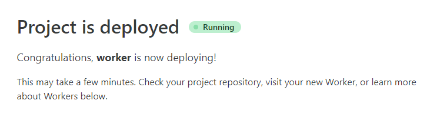
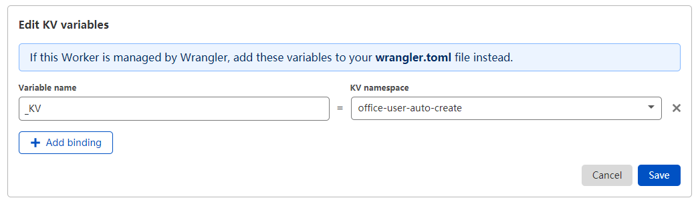
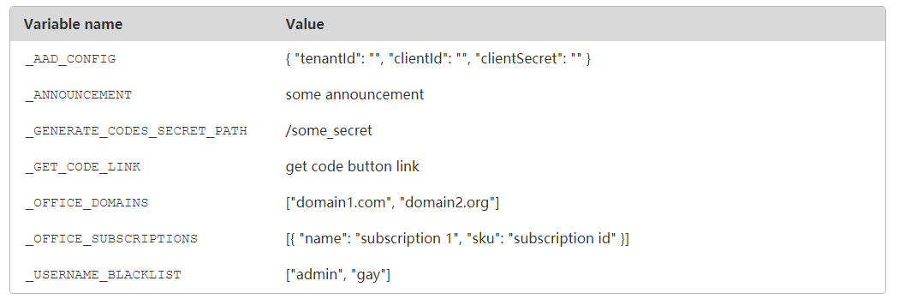

# 🐈 `office-user-auto-create`

## 用 [cloudflare worker](https://workers.cloudflare.com/) 自助创建 office 账号

#### 后端 | [前端](https://github.com/zayabighead/office-user-auto-create/tree/client)

## 🚚 部署

1. 按照提示在 GitHub 上授权 Worker

2. 输入 Cloudflare 的账号 ID 和 [Token](https://dash.cloudflare.com/profile/api-tokens) 并连接账号

    + Token 需要给予 `Edit Workers` 权限
      

3. Fork 项目并启用 GitHub Actions

4. 回到 Cloudfalre Worker 开始部署项目

   

5. 部署成功后新建一个 KV 和环境变量 `_KV` 绑定

   

6. 配置环境变量

   
    + `_ANNOUNCEMENT`: 公告内容，去掉变量则不显示公告
    + `_GET_CODE_LINK`: 获取激活码的连接，可以不填
    + `_AAD_CONFIG`: [Azure Active Directory](https://portal.azure.com/#blade/Microsoft_AAD_IAM/ActiveDirectoryMenuBlade/RegisteredApps)
      的 `APP` 凭证配置
    + `_OFFICE_DOMAINS`: Office 下的域名
    + `_OFFICE_SUBSCRIPTIONS`: Office 的的订阅配置
    + `_USERNAME_BLACKLIST`: 用户名黑名单
    + `_GENERATE_CODES_SECRET_PATH`: 生成激活码的路径，建议生成一个随机密码，生成激活码时浏览器访问 `https://<前缀>.workers.dev/<随机密码>/<数量>`
