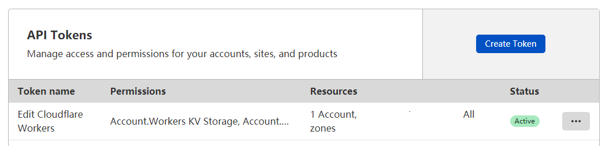

# 🐈 `office-user-auto-create`

[](https://forthebadge.com)

## 用 [cloudflare worker](https://workers.cloudflare.com/) 自助创建 office 账号

#### 后端 | [前端](https://github.com/zayabighead/office-user-auto-create/tree/client)

## 🚚 部署

[](https://deploy.workers.cloudflare.com/?url=https://github.com/zayabighead/office-user-auto-create/tree/worker)

1. 按照提示在 GitHub 上授权 Worker

2. 输入 Cloudflare 的账号 ID 和 [Token](https://dash.cloudflare.com/profile/api-tokens) 并连接账号

    + Token 需要给予 `Edit Workers` 权限
      

3. Fork 项目并启用 GitHub Actions

    + 新建 `main.yml` 并配置 Actions
   ```
   name: Publish
   
   on:
   repository_dispatch:

   jobs:
   
      Publish:
      runs-on: ubuntu-latest
      steps:
   
      - name: Checkout
        uses: actions/checkout@v2
      
      - name: Publish
        uses: cloudflare/wrangler-action@1.3.0
        with:
              apiToken: ${{ secrets.CF_API_TOKEN }}
        env:
              CF_ACCOUNT_ID: ${{ secrets.CF_ACCOUNT_ID }}
   ```

4. 回到 Cloudfalre Worker 开始部署项目
